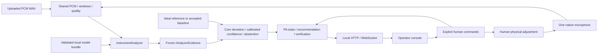

# AI Performance Controller — PA Module

A local, human-operated PA assistant for a known song and instrument configuration.
It compares one mixed-room microphone (or an uploaded recording) with an uploaded
ideal reference during rehearsal, then with a baseline explicitly accepted by the
human PA during Live monitoring. It recommends a volume correction and listens again
after the human adjusts. It never controls a mixer or silently changes the baseline.

## Current milestone

MVP_PRE_MODEL_READY finishes the product workflow, model intake and release preparation that
can be validated without final trained weights. Checkpoint 1 demonstrated the full
workflow with explicit Fake evidence. CP2 adds native continuous audio and real-audio
experiment infrastructure. A passing software test is not musical feasibility,
calibrated confidence, MI300 adaptation, PN54 performance or acoustic demonstration.
See the [module inventory](docs/implementation/MVP_PRE_MODEL_READY.md) for exact status.

Nano4 and MI300 execute independent experiments at exact repository commits. The
first usable artifact/evidence may unblock engineering integration. The final
competition runtime artifact must descend from meaningful official MI300 adaptation.
Critical inference stays local on PN54; no LLM or cloud roundtrip gates perception.

## Architecture



Input adapters acquire and frame audio. AnalyzerEvidence contains measurements and
raw uncertainty, not canonical state or recommendations. Core owns common-mode
removal, centered balance, quality and calibrated confidence. The PA role owns the
human workflow. UI displays authoritative state and never estimates audio. The demo
player is isolated: its only input to the system is sound through the room.

## Install and validate

Use Python 3.12 for the tested local Runtime path and a modern Node.js with built-in
test runner, fetch and WebSocket for UI/integration tests (Node 25 was tested).
Use a virtual environment; the commands below do not install GPU drivers.

```text
python -m venv .venv
```

Activate `.venv/Scripts/Activate.ps1` on Windows PowerShell or
`source .venv/bin/activate` on POSIX, then:

```text
python -m pip install -r requirements-runtime.txt
python scripts/validate.py --runtime-only
```

The full ML tooling suite additionally requires NumPy and PyTorch in the chosen
environment. Existing CPU mechanics were tested with NumPy 2.4.3 and PyTorch
2.11.0+cpu on Python 3.14.3; that is not an MI300/PN54 compatibility claim. Keep the
official remote framework/driver stack and record its actual versions. Do not apply
local CPU pins to a provided ROCm environment without validation.

```text
python scripts/validate.py
```

The validation runner executes shared, Runtime, integration, UI, selected ML suites,
the unchanged full Fake correction-loop smoke, and the source release audit.

## Run locally

See [Runtime launch and deployment](apps/api/README.md) for exact model selection,
inventory, cache and native microphone options as implemented. Basic server command:

```text
python -m uvicorn apps.api.transport:app --host 127.0.0.1 --port 8000 --workers 1 --loop asyncio --http h11 --ws websockets-sansio
```

Open `http://127.0.0.1:8000/apps/ui/`. Reference uploads currently accept bounded
PCM16 WAV. The server stores local state in its configured Runtime storage directory.
Missing or unaccepted production artifacts must remain unavailable/abstained;
simulation is explicit and is not an accuracy demonstration. Use the scripted Fake
end-to-end test to exercise deterministic recommendations and recovery.

Run the isolated playback page separately, not through the Runtime data path:

```text
python -m http.server 8001 --bind 127.0.0.1 --directory demo_player
```

Open `http://127.0.0.1:8001/`. Use permitted audio and follow the
[demo runbook](docs/demo/README.md). Playing audio is not proof of perception.

## Measurement and training methodology

Controlled real-multitrack pairs preserve common amplitude scaling. Raw injected
source gains, common-mode gain, centered balance and valid-source masks are distinct.
All augmentations of one parent recording stay in one grouped split; train,
validation, calibration and untouched test groups are separate. Inference sees only
the legitimate mixed reference, mixed observation and configured instruments.
No stems, injected gains, filenames, player truth or oracle labels enter inference.

Compare separation and direct candidates on identical pairs, then report attribution,
direction, dB error, coverage, abstention, noise/SNR and latency with denominators.
The [ML readiness runbook](benchmarks/CP2_READINESS.md) provides commands. Model intake,
export/parity and calibration handoff follow the
[internal seam](docs/implementation/MODEL_HANDOFF_INTERNAL_V1.md). Real numerical
advice requires held-out evidence, a supported envelope, separate calibration and
host-reviewed matching identities. A sigmoid value is not calibrated confidence.

## Compute and deployment

| Environment | Responsibility |
|---|---|
| Local | Source edits, tests, integration, portable correctness and release preparation |
| Nano4 | Fast empirical probes/sweeps and engineering candidate evidence |
| Official MI300 | Environment validation and meaningful task-specific adaptation with exact artifact lineage |
| PN54 | Actual local provider inventory, microphone, export parity, sustained performance and acoustic demo |

Remote machines execute pushed immutable Git SHAs and hashed configs. They do not
author divergent source changes. A provider installed on one machine is not proof
of actual operator placement, latency or availability on PN54. A matched, measured
CPU profile can be a fallback; remote inference is not a critical-path fallback.

## Claims, limits and release

No absolute per-instrument SPL, specific mixer-fault inference, autonomous mixing,
tone/EQ, section-aware remixing or arbitrary unknown-song recognition is claimed.
Silence, stale data, source inactivity and disconnection cannot establish recovery.
Baselines require explicit acceptance and remain immutable in Live. Verification
requires fresh, observable post-adjustment audio.

Assets and model weights have separate rights/provenance requirements. See the
[source release policy and audit](docs/release/RELEASE_READINESS.md). The existing
private Git history must not be made public: excluded organizer material contained
access details. A scanned source-only export is the prepared publication route.
No third-party corpus, restricted raw recording or signed dataset URL belongs in it.
Original project code currently has no separately granted permissive license.

Authority: AGENTS.md, current handoff, locked product INFO, frozen contracts,
technical design and current implementation decisions. Historical status notes are
superseded by the current inventory and exact checkpoint evidence.
